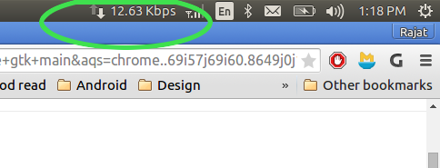

Download Speed Indicator for Ubuntu
===================================

##Introduction
It's simple python script which shows you your downlink network speed in Ubuntu's app indicator bar.

##How to use
Simply execute **indicator.sh** from terminal.

##Screenshot

##Support
Contact me if you need help regarding the script.

##License
GNU GPL v3  